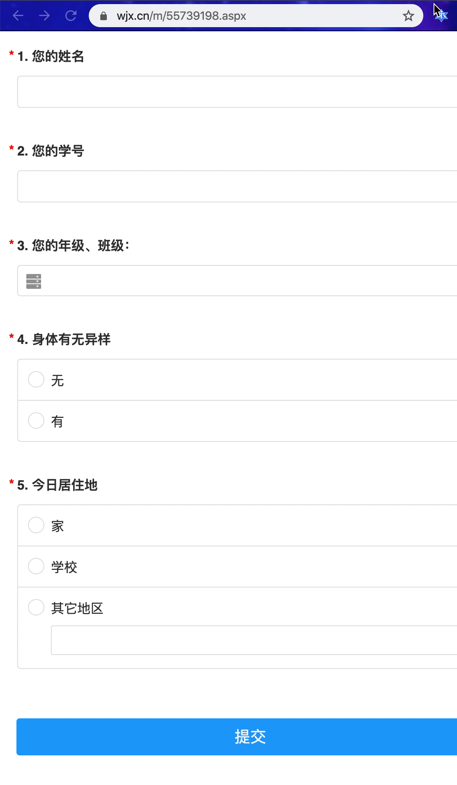
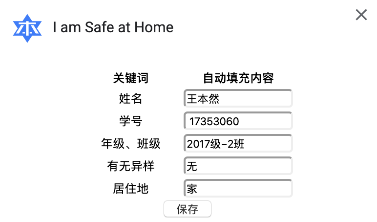

# I am Safe at Home 我在家里很安全

Chrome 浏览器插件

自动填写问卷星问卷，向学校报平安。

效果👇

</img>

配置👇

</img>

## Install & Config 安装与配置

1. 打开 Chrome 浏览器，进入插件页`chrome://extensions/`
2. 打开右上角的开发者模式
3. 点击上方第一个按钮`Load unpacked`
4. 选择 pull 下来的文件夹`I_am_safe_at_home`
5. 邮件网址栏右边插件 icon，选择`选项`
6. 修改配置项给自己的信息

## Usage 使用

1. 在微信群内右键问卷星链接，用浏览器打开/或复制网址
2. 在 Chrome 中打开问卷星问卷页面（移动端）
3. 点击网址栏右边的插件 icon
4. 点击`我在家里很安全`按钮
5. **检查问卷填写内容**
6. 手动点击提交问卷
7. ~~继续宅家~~

## TODO

- [x] 写好配置页面，免除安装前的手动配置的麻烦
- [ ] 对电脑端页面的识别
- [ ] 增加自动填表自由度
  - [ ] 修改关键词
  - [ ] 新增键值对

> 觉得不错就点个 star 呗，给点点鼓励🥳
